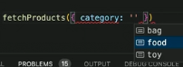

# 학습 키워드

- REPL
- TypeScript
  - Interface vs Type
  - 타입 추론
  - Union Type vs Intersection Type
  - Optional Parameter

# TypeScript

간단히 REPL을 쓰고 싶다면 ts-node를 실행하기!

```bash
npx ts-node
```

- 배열보다 깐깐하게 타입을 관리하고 싶다면 tuple 타입을 써주기

```tsx
let anythings: any[];

anythings = ["hp", 256];

let pair: [string, number];

pair = ["hp", 256];
```

### [타입 추론](https://www.typescriptlang.org/ko/docs/handbook/typescript-in-5-minutes.html#%ED%83%80%EC%9E%85-%EC%B6%94%EB%A1%A0-types-by-inference)

타입스크립트가 알아서 타입을 추론해준다. 너무 깐깐하게 안 써도 된다.

깐깐하게 쓰면 굉장히 좋을 때가 있고 대충 넘어가도 좋을 때가 있다.

모든것을 다 써줘야하는 것은 아니다.

### [Union Type](https://www.typescriptlang.org/ko/docs/handbook/typescript-in-5-minutes.html#%EC%9C%A0%EB%8B%88%EC%96%B8-unions)

여러타입 중 하나

매개변수를 제한하거나 할때 매우 유용하게 쓸 수 있다.

내가 설정한 값 중에 하나만 쓸 수 있음! 자동완성으로 쓸 수 있는 값을 보여준다.

```tsx
type Category = "food" | "toy" | "bag";

function fetchProducts({ category }: { category: Category }) {
  console.log(`Fetch ${category}`);
}
```



- [React Types](https://github.com/facebook/react/blob/main/packages/shared/ReactTypes.js)

유니언 타입은 안 쓸 수가 없다. ex) ReactNode의 타입

자바스크립트 환경 자체가 모든걸 받아서 쓸 수 있게 해놨기 때문에 이거나 이거 다 들어올 수 있다고 써줘야한다.

```tsx
export type ReactNode =
  | React$Element<any>
  | ReactPortal
  | ReactText
  | ReactFragment
  | ReactProvider<any>
  | ReactConsumer<any>;
```

### [Optional Parameter](https://www.typescriptlang.org/docs/handbook/2/functions.html#optional-parameters)

- 함수에서의 사용(parameter가 있을 수도 있고 없을 수도 있을 때)

```tsx
// optional로 처리
function greeting(name?: string): string {
  return `Hello, ${name || "world"}`;
}
// 기본값을 잡아주면 더 좋다.
function greeting(name: string = "world"): string {
  return `Hello, ${name}`;
}
```

- 매개변수가 오브젝트일 때 많이 사용한다.

```tsx
function greeting({ name, age }: { name: string; age?: number }): string {
  return age ? `${name} (${age})` : name;
}
```

### Intersection Type (&)

- 교집합! 둘다 만족을 시켜야한다.

```tsx
type Conflicting = { a: number } & { a: string };
// number와 string을 둘다 만족할 수 없음
// never type으로 되는 것 같음
```

- 타입을 확장하는 간단한 방법

```tsx
type Human = {
  name: string;
  age: number;
};

type Creature = {
  hp: number;
  mp: number;
};

type Person = Human & Creature;

let person: Person;

person = { name: "홍길동", age: 13, hp: 256, mp: 16 };
```

### Generics, Utility Types, and Tips

- [Generics](https://www.typescriptlang.org/docs/handbook/2/generics.html)
- [Utility Types](https://www.typescriptlang.org/docs/handbook/utility-types.html)
- [더 좋은 타입스크립트 프로그래머로 만드는 11가지 팁](https://velog.io/@lky5697/11-tips-that-help-you-become-a-better-typescript-programmer)

### 타입스크립트 좋은점

- VSCode 자동완성 기능
- 오래된 라이브러리의 경우 d.ts 파일만 따로 패키지로 제공됨
- `@types/블라블라` 로 설치할 수 있음
  - [DefinitelyTyped](https://github.com/DefinitelyTyped/DefinitelyTyped)
  - [DefinitelyTyped/types](https://github.com/DefinitelyTyped/DefinitelyTyped/tree/master/types)
  - [DefinitelyTyped/types/react](https://github.com/DefinitelyTyped/DefinitelyTyped/tree/master/types/react)
