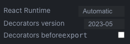

# JSX

> **XML-like syntax extension to ECMAScript**

- jsx는 javascript를 확장한 문법이다.
- jsx는 리액트를 만들면서 나온 부산물이다. 그러나 jsx를 리액트에서만 사용하는 것은 아니다. vue.js에서도 사용할 수 있다.
- JSX는 XML처럼 작성된 부분을 React.createElement을 쓰는 JavaScript 코드로 변환한다. 중괄호를 써서 JavaScript 코드를 그대로 쓸 수 있고, 결국은 JavaScript 코드와 1:1로 매칭된다.

💡 **jsx 관련 읽을거리**

- [facebook의 JSX 소개](https://facebook.github.io/jsx/)
- [React 공식문서의 JSX 소개](https://ko.reactjs.org/docs/introducing-jsx.html)
- [Babel, JSX, 그리고 빌드 과정들](https://ko.reactjs.org/docs/faq-build.html)
- [JSX 이해하기](https://ko.reactjs.org/docs/jsx-in-depth.html)

## Babel

- 변환기 중 제일 유명한 [Babel](https://babeljs.io/repl)로 React.createElement로 변환되는 것을 확인 할 수 있다.

    → “Presets”에서 “react”를 체크하거나, “Plugins”에서 “@babel/plugin-transform-react-jsx”를 추가하면 JSX를 실험할 수 있다.

babel의 설정을  react runtime automatic으로 변경하면 모양이 좀 달라진다.  
react 17부터 변환 방법이 달라졌다.



```tsx
import { jsxs as _jsxs } from "react/jsx-runtime";
import { jsx as _jsx } from "react/jsx-runtime";
/*#__PURE__*/_jsxs("div", {
  children: [/*#__PURE__*/_jsxs("p", {
    children: ["Count: ", count, "!"]
  }), /*#__PURE__*/_jsx("button", {
    type: "button",
    onClick: () => setCount(count + 1),
    children: "Increase"
  })]
});
```

이게 요즘 jsx 방법 , classic은 전통적인 방법이다.  
아래 샘플은 classic방법으로 변환된 샘플들이다.

### Example #1

```jsx
<p>Hello, world!</p>

React.createElement("p", null, "Hello, world!");
```

### Example #2

```jsx
<Greeting name="world" />

React.createElement(Greeting, { name: "world" });
```

### Example #3

```jsx
<Button type="submit">Send</Button>

React.createElement(Button, { type: "submit" }, "Send");
```

### Example #4

```jsx
<div className="test">
	<p>Hello, world!</p>
	<Button type="submit">Send</Button>
</div>

React.createElement(
	"div",
	{ className: "test" },
	React.createElement("p", null, "Hello, world!"),
	React.createElement(Button, { type: "submit" }, "Send")
);
```

### Example #5

```jsx
<div>
	<p>Count: {count}!</p>
	<button type="button" onClick={() => setCount(count + 1)}>Increase</button>
</div>


React.createElement(
	"div",
	null,
	React.createElement("p", null, "Count: ", count, "!"),
	React.createElement("button", { type: "button", onClick: () => setCount(count + 1) }, "Increase")
);
```

## React Element

jsx는 리액트에있는 creactElemet를 쓰도록 코드를 바꿔주는 것이다.

jsx를 사용하는게 필수는 아니다. jsx로 하는건 javascript로도 다 만들수 있다.  

- [JSX 없이 사용하는 React](https://ko.reactjs.org/docs/react-without-jsx.html)
- [createElement](https://beta.reactjs.org/reference/react/createElement)

JSX 대신 그냥 React.createElement를 써서 React Element 트리를 갱신하는데 쓸 수 있다.

JSX Runtime은 _jsx란 함수를, Preact는 h란 함수를 직접 지원:

- [_jsx](https://reactjs.org/blog/2020/09/22/introducing-the-new-jsx-transform.html)
- [h()](https://preactjs.com/guide/v10/api-reference/#h--createelement)

createElement는 react의 엘리먼트를 만든다. 

```tsx
const element = document.createElement(’div’)

element.className = ‘test’
element.appendChild(document.createElement('p'))

...
```

html의 element처럼 리액트 element를 만든다.

## VDOM (Virtual DOM)

- [VDOM (Virtual DOM)](https://ko.reactjs.org/docs/faq-internals.html)
- [재조정 (Reconciliation)](https://ko.reactjs.org/docs/reconciliation.html)

트리는 프랙탈과 같다. 트리의 구성요소는 트리다. 우리는 매번 작은 React Element 트리, VDOM 트리를 만든다. VDOM은 실제 DOM과 비교를 통해 변경사항을 적용한다.

- 실제 dom과 동기화를 효율적으로 해준다.

## React Developer Tools

- [react devtools extensions](https://github.com/facebook/react/tree/main/packages/react-devtools-extensions)  
    → [Strict Mode](https://ko.reactjs.org/docs/strict-mode.html)를 쓰지 않으면 경고함.

strict모드는 2번씩 돌린다.

```tsx
root.render((
	<React.StrictMode>
		<App/>
	</React.StrictMode>
))
```

## VDOM을 쓰는 이유?

🤪 미신: VDOM을 쓰는 건 빠르기 때문이다.

👉 [현실](https://twitter.com/dan_abramov/status/842329893044146176)
 → fast enough
 → maintainable

Dan Abramov

- [Redux](https://redux.js.org/) 창시자
- [React Core 개발자](https://beta.reactjs.org/learn/meet-the-team)

👉 [다시 VDOM 문서](https://ko.reactjs.org/docs/faq-internals.html) 

> “이 접근방식이 React의 **선언적 API**를 가능하게 합니다”

VDOM이 무엇이고, 왜 쓰는지 안다면 활용할 수 있는 [최적화 기법](https://ko.reactjs.org/docs/optimizing-performance.html)이 존재함.

- 빠르기 때문에 쓰는게 아니라,유지보수하기 좋은 어플리케이션을 만드는걸 도와준다. 
- 리액트는 선언형 UI라는 더 나은 구조를 준다. 
- 적절하게 빠르면서 적절하게 관리할 수 있고 유지보수가 가능한 어플리케이션을 만드는데 어느게 균형점일까를 위해서 리액트가 택한 기술이 vdom 이다.