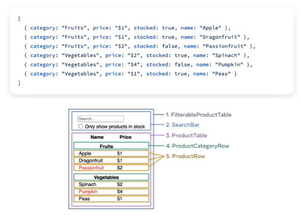

## 학습 키워드

- REST API 와 GraphQL
    - REST API 란 무엇인가
    - GraphQL은 왜 등장했는가?
    - REST API vs GraphQL
- JSON
- DSL(Domain-Specific Language)
- 선언형 프로그래밍
- 명령형 프로그래밍
- SRP(단일 책임 원칙)
- Atomic Design
- React component 와 props


리액트로 웹페이지를 작업하는 프로세스 순서 또는 리액트로 사고하기에 대해서 알아보도록 한다.

공식 문서에서 제공하는 thinking in react의 예제를 함께 만들어 본다.

[git 코드](https://github.com/uhuikim/thinking-in-react)

## Thinking in React

단계는 총 5단계이다.

> [Thinking in React](https://beta.reactjs.org/learn/thinking-in-react)

- “Step 1: Break the UI into a component hierarchy”(컴포넌트 계층구조로 쪼개기 - 컴포넌트 트리를 만든다고 생각하자)
- “Step 2: Build a static version in React”(리액트로 정적인 버전을 먼저 만들어라)

주어진 것 : `데이터` 와 `목업`

## 데이터

B/E에서 JSON 형태의 데이터를 돌려주는 API를 제공한다고 가정(대부분은 REST API 또는 GraphQL).

**REST API**

- GET, POST, PUT/PATCH, DELETE (CRUD)
- Resource 중심

**GraphQL**

- Graph 자료 구조
- Query에서 얻고자 하는 걸 지정
- Query(Read), Mutation(Command: Create, Update, Delete), Subscription(Event)

⇒ REST API 와 GraphQL 둘다 JSON형태로 데이터를 준다. F/E는 이 데이터를 사용자가 볼 수 있도록 UI를 구성한다. React는 선언형(HTML과 유사한 모양의 DSL을 사용)으로 UI를 구성할 수 있다.

```json
[
  { category: "Fruits", price: "$1", stocked: true, name: "Apple" },
  { category: "Fruits", price: "$1", stocked: true, name: "Dragonfruit" },
  { category: "Fruits", price: "$2", stocked: false, name: "Passionfruit" },
  { category: "Vegetables", price: "$2", stocked: true, name: "Spinach" },
  { category: "Vegetables", price: "$4", stocked: false, name: "Pumpkin" },
  { category: "Vegetables", price: "$1", stocked: true, name: "Peas" }
]
```

보통은 json 데이터에 id를 보내주어 key로 사용할 수 있게함

`JSON이란?`

- [JSON](https://ko.wikipedia.org/wiki/JSON)
- [JSON 개요](https://www.json.org/json-ko.html)
- [JSON으로 작업하기](https://developer.mozilla.org/ko/docs/Learn/JavaScript/Objects/JSON)

프론트와 백엔드가 서로 데이터를 교환해야한다. http를 쓰면 string으로 바꿔서 보낸다. 우리는 object형태를 원한다. 이걸 만족시킬 수 있도록 만든 포맷이다. 

```json
JSON.parse() // 문자열을 자바스크립트 객체로 바꿔줌
JSON.stringify() // 객체를 문자열로 바꿔줌
```

`프로그래밍 방법`

- [명령형 프로그래밍](https://ko.wikipedia.org/wiki/명령형_프로그래밍)
- [선언형 프로그래밍](https://ko.wikipedia.org/wiki/선언형_프로그래밍)

기존에는 명령형으로 많이 했었는데 리액트에서는 선언형으로 할 수 있다.

선언형으로 UI를 선언해두면 안에있는 것들이 바꼈을때 자동으로 업데이트가 된다.

## 컴포넌트 계층 구조

> [React](https://reactjs.org/)
> 

React의 강력한 특징 둘 중 하나:

- “**Component-Based**”
- “Build encapsulated components that manage their own state, then **compose** them to make **complex UIs**.”

⇒ 컴포넌트를 조립해서 복잡한 UI를 만든다. 반대로 말하면 컴포넌트 하나하나는 복잡하면 안된다. **컴포넌트는 심플해야한다.**

컴포넌트를 나누는 몇 가지 기준:

- [SRP (Single Responsibility Principle)](https://ko.wikipedia.org/wiki/단일_책임_원칙) ⇒ 단일 책임 원칙
    - 컴포넌트가 너무 커지고 있다면…
    - 컴포넌트 하나가 하는일이 많다면 분리해야함
- CSS → 이미 알고 있는 기준을 재활용.
    
    html로 인해 컴포넌트가 길어지는 경우 css 구조를 활용하여 컴포넌트를 분리한다. thumbnail, price 대한 것을 컴포넌트로 만든다.
    
    ```html
    <div className="product">
    	<div className="thumbnail"> // Thumbnail컴포넌트로 분리
    	...
    	</div>
    	<div className="price"> // Price 컴포넌트로 분리 ,price에 관련된건 여기서 처리
    	</div>
    </div>
    ```
    
- Design’s Layer : 디자인 도구도 트리 구조로 만들어진다. 컴포넌트 구조로 활용할 수 있음
- Information Architecture (JSON Schema의 영향) → 실제로 엄청 많이 쓰게 됨. 자연스러운 SRP를 위해서 사실상 강제됨.
    


⇒ 이 형태를 보여주기에는 데이터의 구조가 비효율적이다. 한번더 가공이 되어야한다. 백엔드에서 얻자마자 가공을 하거나 백엔드에 요청해 수정을 해달라 해야함


작은 컴포넌트=부품을 만들어서 조립. 조합은 가지수를 폭발적으로 늘릴 수 있는 가장 전형적인 방법.

나쁘게 이야기하면 컴포넌트가 폭발적으로 늘어나서 관리하기 힘들 수도 있다. 반대로 이야기하면 적은 부품만 가지고도 조합을 잘하면 여러가지를 만들 수 있다. 

`Atomic Design`

[Atomic Design](https://bradfrost.com/blog/post/atomic-web-design/)은 우리가 잘 알고 있는 계층형 구조를 몇 가지 카테고리로 묶은 방법.

## Extract Function (리팩토링 기법)

> [Extract Function](https://refactoring.com/catalog/extractFunction.html)
> 

> [Inline Function](https://refactoring.com/catalog/inlineFunction.html)
> 

아주 흔히 쓰이는 SRP를 위한 수단. 변화의 크기(영향 범위)를 제약한다.

일단 길게 코드를 작성하고, 적절히 자를 수 있는 부분이 보일 때 “함수로 추출”한다.

또는 코드를 작성하기 어려운 상황에 직면했을 때 함수로 추출. 바로 다른 파일을 만들어야 한다고 생각하지 않아도 됨.

컴포넌트 나누는 기준이 애매하면 다시 하나의 컴포넌트로 합쳤다가(Inline Method) 다시 나눠줘도 됨.

```jsx
function printOwing(invoice) {
  printBanner();
  let outstanding  = calculateOutstanding();

  //print details => 이부분을 설명할 수 있는 function이나 method로 분리해주면 좋다.
  console.log(`name: ${invoice.customer}`);
  console.log(`amount: ${outstanding}`);  
}
```

```jsx
function printOwing(invoice) {
  printBanner();
  let outstanding  = calculateOutstanding();
  printDetails(outstanding);

  function printDetails(outstanding) {
    console.log(`name: ${invoice.customer}`);
    console.log(`amount: ${outstanding}`);
  }
}
```

## Props

[Passing Props to a Component](https://beta.reactjs.org/learn/passing-props-to-a-component)

[Components와 Props](https://ko.reactjs.org/docs/components-and-props.html) 

나눠진 컴포넌트를 서로 연결하는 방법.

TypeScript를 잘 쓰거나 잘못 쓰게 되는 포인트 중 하나. 적절한 균형점을 잡는 게 중요하다.

테스트 코드를 작성하면 재사용성을 평가하기 쉬워짐.

```jsx
{productsInCategory.map((product) => (
    <ProductRow key={product.name} product={product} />
))}

{productsInCategory.map((product) => (
    <ProductRow key={product.name} name={product.name} price={product.price} />
))}
```

⇒ 타입스크립트를 사용할때는 위에 방법처럼 하나로 합쳐서 보내주는것이 훨씬 강력하다. 

name과 price만 필요하다가 갑자기 stocked가 필요할 경우 하나로 보내줬을 경우 바로 사용할 수 있지만 따로 나누어서 보낼경우 위로 올라가서 prop으로 넘겨줘야한다. 

## 간단하게 코딩하면서 원칙들 살펴보기

### Step 1 . static version 만들기

```html
return (
        <div className='filterable-product-table'>

            <div className='search-bar'>
                <div>
                    <input type='text' placeholder='search..' />
                </div>
                <div>
                    <input type='checkbox' id="only-stock" />
                    <label htmlFor='only-stock'>
                        Only show products in stock
                    </label>
                    {/* 회사 스타일 별로 다름 */}
                    {/* <div>
                        <label>
                            <input type='checkbox' />
                            Only show products in stock
                        </label>
                    </div> */}
                </div>
            </div>

            <table className='product-table'>
                <thead>
                    <tr>
                        <th>Name</th>
                        <th>Price</th>
                    </tr>
                </thead>
                <tbody>
                    <tr>
                        <th colSpan={2}>카테고리</th>
                    </tr>
                    <tr>
                        <td>이름</td>
                        <td>$1</td>
                    </tr>
                    <tr>
                        <td>두번째</td>
                        <td>$2</td>
                    </tr>
                </tbody>
            </table>
        </div>
    );
```

⇒ className이나 컴포넌트 이름은 디자이너가 정한 이름을 사용하면 좋다. 코드를 공유하는게 아니라 디자인 파일을 공유하기 때문에 거기서 사용되는 용어를 사용하면 좋다.아니면 기획자가 정한 이름을 씀

### Step 2 . JSON 활용하기

```jsx
import React from 'react';
import './App.css';

interface Product {
  category: string;
  price: string;
  stocked: boolean;
  name: string;
}

const products: Product[] = [
  { category: "Fruits", price: "$1", stocked: true, name: "Apple" },
  { category: "Fruits", price: "$1", stocked: true, name: "Dragonfruit" },
  { category: "Fruits", price: "$2", stocked: false, name: "Passionfruit" },
  { category: "Vegetables", price: "$2", stocked: true, name: "Spinach" },
  { category: "Vegetables", price: "$4", stocked: false, name: "Pumpkin" },
  { category: "Vegetables", price: "$1", stocked: true, name: "Peas" }
]

function App() {

  const categories = products.reduce((acc: string[], product: Product) => (
    acc.includes(product.category) ? acc : [...acc, product.category]
  ), []);

  return (
    <div className='filterable-product-table'>

      <div className='search-bar'>
        <div>
          <input type='text' placeholder='search..' />
        </div>
        <div>
          <input type='checkbox' id="only-stock" />
          <label htmlFor='only-stock'>
            Only show products in stock
          </label>
        </div>
      </div>

      <table className='product-table'>
        <thead>
          <tr>
            <th>Name</th>
            <th>Price</th>
          </tr>
        </thead>
        <tbody>
          <tr>
            <th colSpan={2}>{categories[0]}</th>
          </tr>
          {products.filter((product) => product.category === categories[0]).map((product) => (
            <tr key={product.name}>
              <td>{product.name}</td>
              <td>{product.price}</td>
            </tr>
          ))}
          <tr>
            <th colSpan={2}>{categories[1]}</th>
          </tr>
          {products.filter((product) => product.category === categories[1]).map((product) => (
            <tr key={product.name}>
              <td>{product.name}</td>
              <td>{product.price}</td>
            </tr>
          ))}
        </tbody>
      </table>
    </div>
  );
}

export default App;
```

⇒ SRP를 위반하고 있음, 너무 길다.

### Step 3 . 컴포넌트 분리하기

- 리팩토링 기법 extract function 처럼 재사용할 수 있게 분해를 해주기

```jsx
import { Product } from './types/Product';

import './App.css';

import FilterableProductTable from './components/FilterableProductTable';

const products: Product[] = [
  { category: "Fruits", price: "$1", stocked: true, name: "Apple" },
  { category: "Fruits", price: "$1", stocked: true, name: "Dragonfruit" },
  { category: "Fruits", price: "$2", stocked: false, name: "Passionfruit" },
  { category: "Vegetables", price: "$2", stocked: true, name: "Spinach" },
  { category: "Vegetables", price: "$4", stocked: false, name: "Pumpkin" },
  { category: "Vegetables", price: "$1", stocked: true, name: "Peas" }
]

function App() {

  return (
    <FilterableProductTable products={products} />
  );
}

export default App;
```

⇒ 컴포넌트를 쪼개서 App에서 하는 일이 적게 만들어 준다.


❗ 데이터 구조가 바뀌면 위와 같이 안짜도 된다. 
```js
interface Category {
    name: string;
    products: Product[]
}
```
이런 구조라면 더 쉽게 코드를 짤 수 있다.