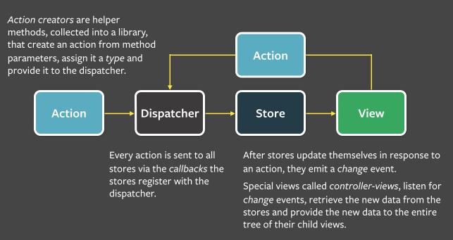

# ****External Store****

## 학습 키워드

- 관심사의 분리
- Layered Architecture
- Flux Architecture
- useReducer
- useCallback

리액트의 외부에서 external store 형태로 상태를 관리하는 방법을 알아본다.

# 관심사의 분리

특정한 관심사에 따라 기능을 나누고, 각 기능을 독립적으로 개발한 뒤 이를 조합하는 방식으로 복잡한 소프트웨어를 구성해보자는 아이디어를 **관심사의 분리(Separation of concerns, SoC)**라고 한다.

관심사를 분리하여 코드를 작성하게 되면, 독립된 특정 기능에 집중할 수 있기 때문에 코드를 파악하는데 수월하며 특정 기능을 변경하거나 추가할 때도 그 부분만 교체하면 되기 때문에 훨씬 간단하게 문제를 해결할 수 있을 것이다.

`관심사를 나누는 방법`

- 기능 위주
- Layered Architecture 설계관점
- process 관점

## 기능 위주의 관심사 분리

리액트에서는 이미 작은 컴포넌트를 합쳐서 더 큰 컴포넌트를 만드는 방식으로 개발하고 있다. 

APP

- Header
- Main
    - Greeting
    - Counter
    - Posts
    - PostForm
        - TextField
- Footer

각 컴포넌트들은 서로 관심사가 완전히 다르고, 기능이 완전히 다르다.

## Layered Architecture

Layered Architecture에선 사용자에게 가까운 것과 사용자에게서 먼 것으로 구분한다. 가장 가까운 건 UI를 다루는 부분, 그 다음엔 Business Logic을 다루는 부분, 그 너머에는 데이터에 접근하고 저장하는 부분으로 나눌 수 있게 된다. 각 부분은 하나의 역할, 하나의 관심사로 격리됨으로써 복잡도를 낮추게 된다.

일반적인 경우 4개의 레이어로 구분한다.

- Presentation Layer
- Business Layer
- Persistence Layer
- Database Layer

예시로 스위치를 누르면 돌아가는 바퀴를 생각해보자

사람 - 스위치(UI) - 모터 - 바퀴

각각은 하나의 역할을 한다. 스위치의 관심사는 on/off만 관여한다. 모터는 전류가 흐르면 돌기만 하면 된다. 사용자입장에서 버튼이 누르기 쉽거나 말거나 상관이 없어진다. 각자 다른 역할, 다른 관심사를 가지는 것이다.

## 프로세스 관점의 관심사 분리

거대한 프로그램이 아니라고 해도 흔히 Input → Process → Output이란 3단계로 코드를 적절히 구분만 해도 코드를 이해하고 유지보수하는데 크게 도움이 된다. 하나의 Output은 다시 사용자에게 Input을 요청하게 되고, 일반적인 프로그램은 다음과 같이 계속 순환하는 구조가 된다.

1. Input: 프로그램 시작
2. Process: 프로그램 초기화
3. Output: 사용자에게 초기 UI 보여주기
4. Input: 사용자의 입력
5. Process: 사용자의 입력에 따라 처리
6. Output: 처리 결과 보여주기
7. Input: 사용자의 또 다른 입력
8. …반복…

널리 알려진 MVC로 거칠게 매핑하면 다음과 같다.

- Model → Process
- View → Output
- Controller → Input

# Flux Architecture

> [Flux](https://facebook.github.io/flux/docs/in-depth-overview/)
> 

> [Flux (한국어)](https://haruair.github.io/flux/docs/overview.html)
> 

> [Redux의 핵심](https://ko.redux.js.org/tutorials/essentials/part-1-overview-concepts)
> 



Facebook(현 Meta)에서 MVC의 대안으로 내세운 아키텍처. 2-way binding을 썼을 때 생길 수 있는 Model-View의 복잡한 관계(전통적인 MVC에선 이런 상황을 지양한다)를 겨냥해 명확히 “**unidirectional data flow**”를 강조한다.

1. Action → 이벤트/메시지 같은 객체.
2. Dispatcher → (여러) Store로 Action을 전달. 메시지 브로커와 유사하다.
3. Store (여러 개) → 받은 Action에 따라 상태를 변경. 상태 변경을 알림.
4. View → Store의 상태를 반영.

Flux는 MVC와 다르게 단방향으로 데이터가 흐른다. React view에서 사용자가 상호작용을 할 때, 그 view는 중앙의 dispatcher를 통해 action을 전파하게 된다. 어플리케이션의 데이터와 비지니스 로직을 가지고 있는 store는 action이 전파되면 이 action에 영향이 있는 모든 view를 갱신한다. 이 방식은 특히 React의 선언형 프로그래밍 스타일 즉, view가 어떤 방식으로 갱신해야 되는지 일일이 작성하지 않고서도 데이터를 변경할 수 있는 형태에서 편리하다.

Redux는 단일 Store를 사용함으로써 좀 더 단순한 그림을 제안한다.

1. Action
2. Store → dispatch를 통해 Action을 받고, 사용자가 정의한 reducer를 통해 State를 변경한다. 기존의 state를 변경하는 것이 아닌 새로운 state를 만든다.
3. View → State를 반영.

```jsx
const state = {
	name : "tester"
}
// state.name = "New Name" 이렇게 하지 않는다.기존 state객체는 망가지지 않는다.
const nextState = {...state, name : "new Name"}
```

Action을 어떻게 표현하느냐가 사용성에 큰 차이를 만든다. 하지만 상태를 UI에 반영하는 방법은 모두 동일하다.

3단계 프로세스와 거칠게 매핑하면 다음과 같다.

- Input → Action + dispatch
- Process → reducer
- Output → View(React)

## External Store

> [forceUpdate와 같은 것이 있습니까?](https://ko.reactjs.org/docs/hooks-faq.html#is-there-something-like-forceupdate)
> 

react 입장에서 store가 밖에 있다.

상태가 변경되면 렌더링을 해줘야한다. 원래는 useState를 써서 상태 변경을 감지했는데, external store를 사용해야한다.

react 밖에서 사용하는 상태가 변경이 되었을때 화면에 반영하는 방법을 알아보자

## forceUpdate

클래스 컴포넌트 시절 forceUpdate가 있어서 강제로 리렌더링을 시킬 수 있었다.

아래와 같은 방법으로 리렌더링을 할 수 있다.

```jsx
const [ignored, forceUpdate] = useReducer(x => x + 1, 0);
// 사용하지 않을 경우 지워도 된다.
//const [, forceUpdate] = useReducer(x => x + 1, 0);

  function handleClick() {
    forceUpdate();
  }
```

useReducer가 기본형이고 setState가 내부적으로 useReducer를 사용하고 있다. 거의 같은거라고 보면 된다. 

```tsx
function useForceUpdate() {
	const [, setState] = useState({});
	return useCallback(() => setState({}), []);
}
```

내부적으로 상태가 그대로면 아무것도 하지 않는다.

겉으로 보기에는 {} 동일해보이지만 새로운 객체를 생성하는 거라서 위에 코드도 잘 동작한다. 

함수가 매번 바뀔필요가 없다. 동일한 함수를 사용하기 위해서 useCallback을 사용해준다. 

```jsx
const state = {
	count : 0,
}

export default function Counter(){
	const forceUpdate = useForceUpdate();

	const handleClick = () => {
		state.count +=1;
		forceUpdate();
	}

	return (
		<div>
			<p>{state.count}</p>
			<button type="button" onClick={handleClick}>
				Increase
			</button>
		</div>
	);
}
```

비즈니스 로직과 UI를 관심사 분리를 해준다.

```jsx
// Business Logic

const state = {
	count : 0,
}

function increase(){
	state.count +=1;
}

// UI
export default function Counter(){
	const forceUpdate = useForceUpdate();

	const handleClick = () => {
		increase()
		forceUpdate();
	}

	return (
		<div>
			<p>{state.count}</p>
			<button type="button" onClick={handleClick}>
				Increase
			</button>
		</div>
	);
}
```

이런식으로 코드를 분리하면 테스트 하기도 훨씬 수월해진다. UI에서는 button을 클릭했을때 handleClick이 실행이 되는지만 확인을 하면 된다. 안에서 어떤 로직이 실행이 되는지는 알 필요가 없다. 

비즈니스 로직은 잘 바뀌지 않는다. UI는 자주 변경이 된다. UI에 로직이 물려있을 경우 변경이 있을때 테스트가 터지게 된다.

이런 접근을 잘 하면, React가 UI를 담당하고, 순수한 TypeScript(또는 JavaScript)가 비즈니스 로직을 담당하는, 관심사의 분리(Separation of Concerns)를 명확히 할 수 있다. 자주 바뀌는 UI 요소에 대한 테스트 대신, 오래 유지되는(바뀌면 치명적인) 비즈니스 로직에 대한 테스트 코드를 작성해 유지보수에 도움이 되는 테스트 코드를 치밀하게 작성할 수 있다.