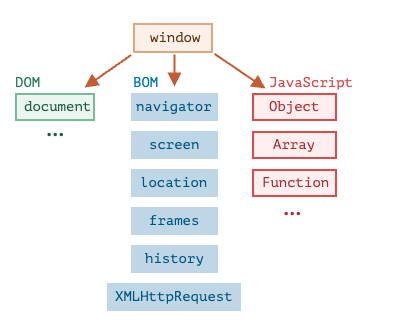

# Routing

## 학습 키워드

- HTML DOM API
    - Location
    - pathname

## ****브라우저 환경****

자바스크립트가 돌아가는 환경(호스트환경)은 랭귀지 코어(ECMAScript)에 더하여 플랫폼에 특정되는 객체와 함수를 제공한다. 

- 웹브라우저:  웹페이지를 제어하기 위한 수단을 제공
- Node.js: 서버 사이드 기능 제공



### window 객체

최상단엔 `window`라 불리는 ‘루트’ 객체가 있다.

- 브라우저 안의 모든 요소들이 소속된 객체로, 최상위에 있기 때문에 어디서든 접근이 가능하다고 해서 '전역 객체'라고도 부른다.
- 일반적으로 우리가 열고 있는 브라우저의 창(browser window)을 의미하고, 이 창을 제어하는 다양한 메서드를 제공한다.
    - window.close(), window.open() 메서드를 활용하면, 창을 열거나 닫을 수 있고, window.innerWidth, window.innerHeight 같은 프로퍼티에 접근하면 창의 너비와 높이 등을 확인할 수도 있다.

### DOM

문서 객체 모델(Document Object Model, DOM)은 웹 페이지 내의 모든 콘텐츠를 객체로 나타내준다. 이 객체는 수정이 가능하다.

### BOM

브라우저 객체 모델(Browser Object Model, BOM)은 문서 이외의 모든 것을 제어하기 위해 브라우저(호스트 환경)가 제공하는 추가 객체를 나타낸다.

- location : 브라우저 현재 위치(URL)에 대한 정보를 반환한다.
- navigator : 브라우저와 운영체제에 대한 정보를 제공한다.
- history : 브라우저의 방문 페이지에 대한 정보를 설정한다.
- screen : 브라우저 screen 객체에 대한 정보를 반환한다.
- frames : 브라우저에 구조를 프레임을 형태로 표현한다.

## Location

**`Location`** 인터페이스는 객체가 연결된 장소(URL)를 표현합니다.

- pathname
    - / 문자 뒤 URL의 경로
- hash
    - # 문자 뒤 URL의 프래그먼트 식별자를 값
    - encodeURI / decodeURI
- host
    - 호스트명, `':'`, 포트 번호를 포함 ex) localhost:8080
- hostname
    - URL의 도메인 부분 ex) localhost

## Routing

- 일반적인 웹 사이트는 URL에 따라 다른 웹 페이지를 보여준다.
- 하나의 웹 페이지를 하나의 컴포넌트로 만들고, URL에 따라 적절한 컴포넌트가 보이게 함으로써 구현 가능함.

```tsx
function App() {
	const { pathname } = window.location;
	
	return (
		<div>
			<Header />
			<main>
				{pathname === '/' && <HomePage />}
				{pathname === '/about' && <AboutPage />}
			</main>
			<Footer />
		</div>
	);
}

// OR

const pages = {
	'/' : HomePage,
	'/about' : AboutPage	
}

function App() {
	const { pathname } = window.location;
	const Page = Reflect.get(pages, path) || HomePage;
	
	return (
		<div>
			<Header />
			<main>
				<Page/>
			</main>
			<Footer />
		</div>
	);
}

```

```jsx
export default function Header(){
	return (
		<header>
			<nav>
				<ul>
					<li>
						<a href="/">Home</a>
					</li>
					<li>
						<a href="/about">About</a>
					</li>
				</ul>
			</nav>
		</header>
	)
}
```

# 참고

[브라우저 환경과 다양한 명세서](https://ko.javascript.info/browser-environment)

[window 객체](https://webzz.tistory.com/81)