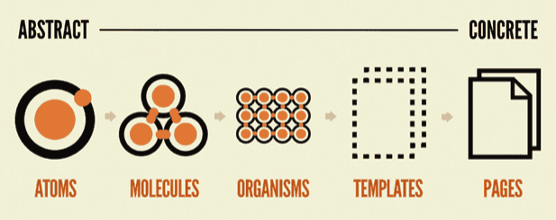

## 학습 키워드

- 반응형 웹 디자인(Responsive web design)
- 디자인 시스템(Design System)
- Atomic Design

# Design System

### 로라 칼바그

디자인 시스템이란 용어를 알린 분

- [Laura Kalbag의 “Design Systems” 소개](https://24ways.org/2012/design-systems/)
- [Laura Kalbag의 “Design Systems” 슬라이드](https://speakerdeck.com/laurakalbag/design-systems-1)

### 앨런 쿠퍼

인터랙션 디자인 분야의 전문가

### 닐슨 노먼 그룹

닐슨 노먼 그룹은 1998년에 설립되어 20년이 넘는 UX 컨설팅 경력이 있는 회사이다. 주요 클라이언트로 eBay, Google, VISA등의 글로벌 기업들이 있다.

도널드 노먼과 제이콥 닐슨이 공동으로 설립하였다. 

`도널드 노먼`

- 사용자 경험이라는 용어를 최초로 만들어 사용한 인물이다.

`제이콥 닐슨`

- 전 세계에서 UI 디자인의 기본 원칙으로 참조되는 프레임워크인 10가지 사용성 휴리스틱을 발명한 인물이다.
- 제품의 사용성 향상과 함께 사용자의 접근성을 높이기 위한 빠르고 효율적인 방법을 널리 퍼뜨린 분이다.

`디자인 시스템 101`

**[Design Systems 101](https://www.nngroup.com/articles/design-systems-101/)**

**디자인 시스템이란?**

중복성을 줄이고 다양한 페이지와 채널에서 공유된 언어와 시각적 일관성을 만들어 대규모로 디자인을 관리하기 위한 일련의 표준

**디자인 시스템을 사용하는 이유**

- 설계(및 개발) 작업을 신속하게 대규모로 생성하고 복제할 수 있다.
- 더 크고 복잡한 문제에 집중하기 위해 설계 리소스의 부담을 덜어준다.
- 교차 기능 팀 내에서 그리고 팀 간에 통합된 언어를 만든다.
- 제품, 채널 및 (잠재적으로 고립된) 부서 전반에 걸쳐 시각적 일관성을 만든다.
- 주니어 레벨 디자이너와 콘텐츠 기고가를 위한 교육 도구 및 참고 자료로 사용할 수 있다.

## 디자인 시스템 사례

- [Atlassian Design System](https://atlassian.design/)
- [Material Design (Google)](https://material.io/)
- [Base Web (Uber)](https://baseweb.design/)
- [Polaris (Shopify)](https://polaris.shopify.com/)
- [Lightning Design System (Salesforce)](https://www.lightningdesignsystem.com/)
- [Mailchimp Pattern Library](https://ux.mailchimp.com/patterns)
- [Ant Design](https://ant.design/)

### Gallery

- [Design Systems Gallery](https://designsystemsrepo.com/design-systems/)
- [Design Systems](https://www.designsystems.com/open-design-systems/)

# Atomic Design

> [Atomic Design 소개 글](https://bradfrost.com/blog/post/atomic-web-design/)
> 

> [Atomic Design 전자책](https://atomicdesign.bradfrost.com/)
> 

- 화학적 관점에서 영감을 얻은 디자인 시스템을 만들기 위한 방법론이다.
- 컴포넌트를 atom, molecule, organism, template, page의 5가지 레벨로 나눈다.

****Atom****

- atom은 더 이상 분해할 수 없는 기본 컴포넌트
- 단일 컴포넌트로 사용하기엔 어려운 경우가 있다.

****Molecule****

- molecule은 여러 개의 atom을 결합하여 자신의 고유한 특성을 가진다.
- molecule의 중요한 점은 한 가지 일을 하는 것이다.